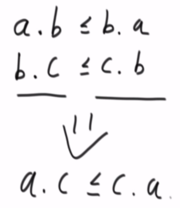

# 1.贪心

贪心的定义：

定义一个指标，在这个指标之下，让每一个样本分出一个优先级，优先级大的先执行，优先级小的后执行


## 1.1 贪心例题

存在很多个字符串，我们想要将字符串拼接成为字典序最小的字符串。

如果两个字符串的长度是相等的，我们直接将字符串看成26进制数直接进行字面值的比较即可

如果两个字符串的长度是不等的，我们对长度较短的字符串在尾部添加值最小的字母让长度对齐后再进行字面值的比较即可


### 1.1.1 贪心策略

st1拼接str2之后的字典序 <= str2拼接str1之后的字典序，那么str1放在前面，否则str2放在前面。


### 1.1.2 完整代码

```java
public class Solution {
    public static class MyComparator implements Comparator<String> {
        @Override
        public int compare(String a, String b) {
            return (a + b).compareTo(b + a);
        }
    }

    public static String lowestString(String[] strs) {
        if (strs == null || strs.length == 0) {
            return "";
        }
        Arrays.sort(strs, new MyComparator());
        String res = "";
        for (int i = 0; i < strs.length; i++) {
            res += strs[i];
        }
        return res;
    }

    public static void main(String[] args) {
        String[] strs1 = { "jibw", "ji", "jp", "bw", "jibw" };
        System.out.println(lowestString(strs1));

        String[] strs2 = { "ba", "b" };
        System.out.println(lowestString(strs2));

    }
}

```

### 1.1.3 贪心的证明

关键是证明有没有传递性。



将a和b都理解为k进制的数:
$$
a\,\,\text{拼接} b\,\,\text{可以理解为} a\,\,* K^b\,\,+\,\,b
\\
\text{我们令}m\left( x \right) \,\,=\,\,K^x
\\
\text{那么}a\,\,\text{拼接} b\,\,\text{可以理解为} a\,\,* m\left( b \right) \,\,+\,\,b
$$

$$
a\,\,\text{拼接} b\,\,\leqslant \,\,b\,\,\text{拼接} a\,\,=>\,\,a\,\,* m\left( b \right) \,\,+\,\,b\,\,\leqslant \,\,b\,\,* m\left( a \right) \,\,+\,\,a\,\, 1\text{式}
\\
b\,\,\text{拼接} c\,\,\leqslant \,\,c\,\,\text{拼接} b\,\,=>\,\,b\,\,* m\left( c \right) \,\,+\,\,c\,\,\leqslant \,\,c\,\,* m\left( b \right) \,\,+\,\,b\,\,  2\text{式}
\\
\left( 1 \text{式两边同时} -b \right) \,\,* c\,\,=>\,\, a\,\,* m\left( b \right) \,\,* c\,\,\leqslant \,\,\left( b\,\,* m\left( a \right) \,\,+\,\,a\,\,-\,\,b \right) \,\,* c
\\
\,\,\left( 2\text{式两边同时} -\,\,b \right) * a\,\,=>\,\,\left( b\,\,* m\left( c \right) \,\,+\,\,c\,\,-b \right) \,\,* a\,\,\leqslant \,\,c\,\,* m\left( b \right) \,\,* a\,\,
\\
\text{于是结合两个式子得到} \left( b\,\,* m\left( c \right) \,\,+\,\,c\,\,-b \right) \,\,* a\,\, \leqslant \,\,\left( b\,\,* m\left( a \right) \,\,+\,\,a\,\,-\,\,b \right) \,\,* c
\\
\text{进一步化简得到}  m\left( c \right) \,\,* a\,\,+\,\,c\,\,\leqslant \,\,m\left( a \right) \,\,* c\,\,+\,\,a
$$