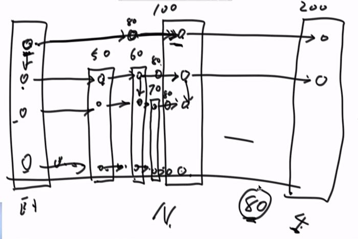

# 1.跳表

## 1.1 定义

跳表类似于红黑树，平衡搜索二叉树的结构，其中的key是按照顺序来组织的，他可以完成红黑树类似的操作，比如找到最大的key,最小的key，或者通过key取出value,代价也是O(logN),但是他的底层不是树结构。

## 1.2 Redis之中的跳表

每一个点要插入的个数，或者说插入的层数是随机决定的，就是随机抛硬币，如果第一次抛出1，则只插入1层，如果第二次才抛出1，则插入两层，如果第三次才抛出1，则插入三层,……以此类推。

如图所示，0插了4层，100查了4层，200插了4层，50插了三层，60插了三层，70插了2层。当80这个结点在第四次扔出了1，所以80也要插入4层，所以此时，80从最上层开始进行插入，发现80小于100所以插入在左侧，然后遍历50，60，发现80小于100，所以插入在第三层的60和100之间，接着从第二层的60开始进行遍历，发现80位于70-100之间，所以80插入在70-100之间，以此类推

## 1.3 跳表节约时间的原理

在越高层的跳表每一步可以跳过很多底层的数，虽然每一个数都会在最底层有一个表现，这也是它称之为跳表的原因。